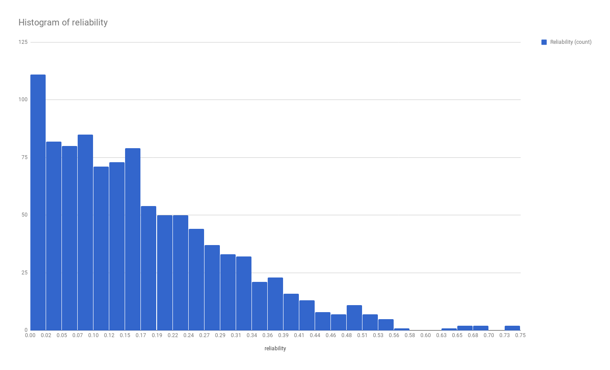

==============================
Экспериментальное исследование
==============================

Генерация входных данных
========================

С помощью отдельного скрипта на питоне
была сгенерирована 1000 примеров входных данных
для каждого значения параметра ``k``.

Параметры запуска
-----------------

+ 6 модулей (``N = 6``)
+ 5 вариантов в каждом модуле (``M = 5``)
+ Цена вариантов - случайное число из ``{1, 2, 3, 4, 5}``
+ Порог цены - ``k * N``, где ``k`` из ``{2, 2.2, 2.5, 3, 4}``

Гипотеза
========

Надежность последовательно соединенных модулей определена как
произведение надежностей этих модулей. Оценим среднее значение
надежности.

Исходные данные распределены однородно в интервале ``[0, 1]``.
Ограничения по цене мы не достигнем, если ``MAX_COST == 5 * MODULE_COUNT``,
потому что значение ``COST`` для каждого модуля не превышает ``5``.

Тогда без ограничения по цене мы можем сказать, что
основная часть (больше ``80%``) распределения будет находится в интервале ``[0, 0.5]``
с вероятностью больше ``99%``. То есть вероятность того, что надежность системы
будет в интервале ``[0, 0.5]`` будет больше ``80%``.

Если же уменьшать ``MAX_COST``, то максимальная надежность может только уменьшиться,
так как вводится дополнительное ограничение на стоимость, которое может исключить
оптимальный выбор вариантов для обеспечения максимальной надежности.

Результаты тестирования
=======================

MAX_COST = 2.0 * MODULE_COUNT
-----------------------------

MAX_COST = 2.2 * MODULE_COUNT
-----------------------------

.. image:: img/2.2.png
    :width: 600
    :height: 371

MAX_COST = 2.5 * MODULE_COUNT
-----------------------------

MAX_COST = 3.0 * MODULE_COUNT
-----------------------------

MAX_COST = 4.0 * MODULE_COUNT
-----------------------------

MAX_COST = 5.0 * MODULE_COUNT
-----------------------------

